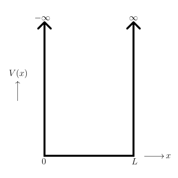

# 波動関数の導出

シュレディンガー方程式は1次元モデルでは、

$$
\frac{\partial^2 \psi(x)}{\partial x^2} + \frac{2m}{\hbar^2} E \psi(x) = 0 \tag{1}
$$

と表せる。ここで、 $\psi(x)$ は電子の波動関数、 $E$ は電子のエネルギー、 $m$ は電子の質量である。

ここで、

$$
k^2 \equiv \frac{2m E}{\hbar^2} \tag{2}
$$

とおくと、(1)式は、

$$
\frac{\partial^2 \psi(x)}{\partial x^2} + k^2 \psi(x) = 0 \tag{3}
$$

となる。この解は、

$$
\psi(x) = A \exp(i k x) + B \exp(-i k x) \tag{4}
$$

となる。

$$
\psi(x) = C \sin(k x) \tag{6}
$$

$$
\psi(x) = C \exp(i k x) \tag{7}
$$